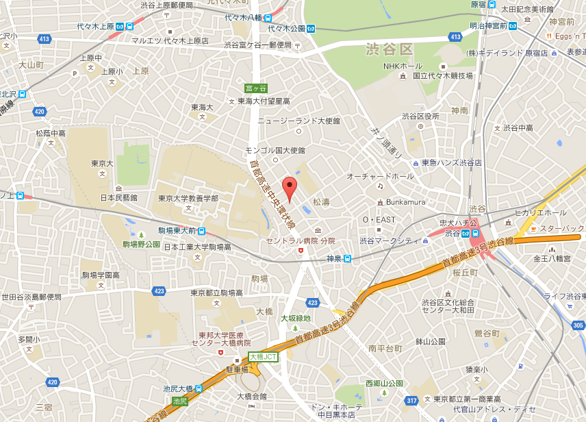

# GoogleMapsJavascriptAPIv3
version 3

#Environment
This library tested on

- Google Chrome 42
- Mozilla Firefox 38.0.1
- IE11

#Details

###Maps
index.html - default map

infowindow.html - 情報ウィンドウ表示

options.html - マップオプション変更

###Marker
marker.html - マーカー表示

marker_click.html - クリック位置にマーカー表示

marker_infowindow.html - マーカーと情報ウィンドウの連動

marker_options.html - マーカーオプション変更(マーカー画像の変更)

###Adress
adress.html - 現在地マップ表示

adress_click.html - クリック位置に住所表示

adress_latlng.html - 住所を緯度経度に変換後表示

adress_move.html - 住所を入力後に地図移動

#Author
Fumihiko Akagi

#Copyright
  
    The MIT License

    Copyright (c) 2015 Fumihiko Akagi

    Permission is hereby granted, free of charge, to any person obtaining a copy of this
    software and associateddocumentation files (the "Software"), to deal in the Software
    without restriction, including without limitationthe rights to use, copy, modify, merge,
    publish, distribute,sublicense, and/or sell copies of the Software,and to permit persons
    to whom the Software is furnished to do so, subject to the following conditions:

    The above copyright notice and this permission notice shall be included in all copies or 
    substantial portions of the Software.

    THE SOFTWARE IS PROVIDED "AS IS", WITHOUT WARRANTY OF ANY KIND, EXPRESS OR IMPLIED, 
    INCLUDING BUT NOT LIMITED TO THE   WARRANTIES OF MERCHANTABILITY, FITNESS FOR A
    PARTICULAR PURPOSE AND NONINFRINGEMENT. IN NO EVENT SHALL THE A UTHORS OR COPYRIGHT
    HOLDERS BE LIABLE FOR ANY CLAIM, DAMAGES OR OTHER LIABILITY, WHETHER IN AN ACTION OF
    CONTRACT, TORT OR OTHERWISE, ARISING FROM, OUT OF OR IN CONNECTION WITH THE SOFTWARE
    OR THE USE OR OTHER DEALINGS IN THE SOFTWARE.
